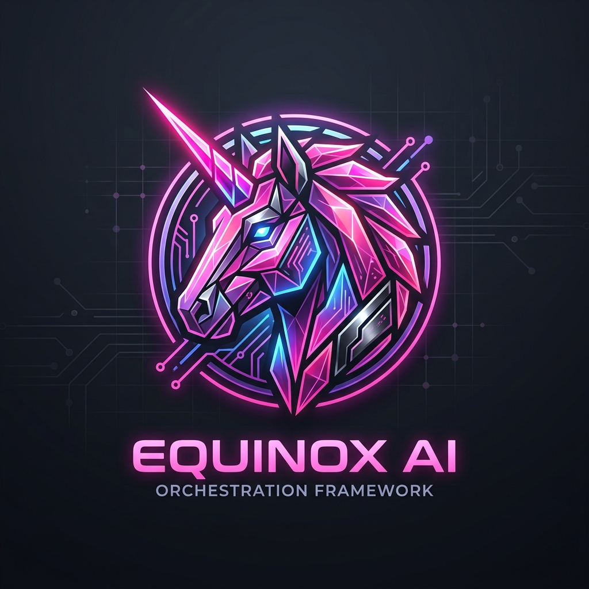

<div align="center">



# Elite Workforce Orchestrator

**Cyclic StateGraph Architecture & Autonomous Closed-Loop Engineering Synthesis**  
*Autonomous Multi-Agent Workforces | Dynamic 5D Complexity Grading | Git Worktree Isolation | Multi-Provider CLI Bridge | Deterministic Q&Q Scorecards*

</div>

---

## 1. Overview & Core Philosophy

**Elite Workforce Orchestrator** is an enterprise-grade autonomous software engineering coordination framework. It bridges **Google Cyclic StateGraph Engineering** with **Autonomous Closed-Loop (Head of Claude Code) Loop Engineering** to dispatch, isolate, execute, and verify parallel subagent teams across frontier AI models and isolated Git worktrees.

```
                              [TASK OBJECTIVE & SPECIFICATION]
                                              |
                                              v
                              +-------------------------------+
                              |   5D Task Complexity Grader   |
                              |   (Surface, Depth, Risk, Con) |
                              +-------------------------------+
                                              |
                     +------------------------+------------------------+
                     |                        |                        |
                     v                        v                        v
            [Worktree Alpha]          [Worktree Beta]          [Worktree Gamma]
            (Backend Engine)          (Security/Guard)         (Frontend UX)
                     |                        |                        |
                     +------------------------+------------------------+
                                              |
                                              v
                             +---------------------------------+
                             |    Autonomous Closed Loop     |
                             |    - tmp_path TDD Contracts     |
                             |    - Multi-Language Static Gate |
                             |    - 2-Pass Code Simplifier     |
                             +---------------------------------+
                                              |
                                              v
                             +---------------------------------+
                             |     Continuous Q&Q Auditor      |
                             |   - Speedup vs Sequential (4.6x)|
                             |   - Sparklines & Living Scorecard
                             +---------------------------------+
                                              |
                                              v
                                   [Atomic Git Merge & Commit]
```

### Core Tenets
1. **Loop Engineering Over Prompting**: *"I don't prompt anymore. I write loops that prompt the agents."* Subagents operate inside closed feedback loops with automated AST parsers and test runners fixing errors autonomously.
2. **Universal Worktree Mandate (BM-INV-028)**: In-place code mutation on active service checkouts is strictly prohibited. All concurrent development executes inside isolated Git worktrees (`git worktree add`).
3. **Multi-Provider CLI Bridge**: Simultaneously leverage token budgets and specialized reasoning strengths across **Anthropic Claude Code**, **OpenAI Codex**, **Moonshot Kimi Code**, and **Google Antigravity**.
4. **Agentic Tool-Based Retrieval**: Zero monolithic RAG context dumping. AST call graphs, `grep_search`, and precision line slices maintain high attention entropy.
5. **Deterministic Verification**: Every code mutation must pass isolated `tmp_path` unit tests, multi-language linters (0 errors), and the automated `code-simplifier` pass before merging.

---

## 2. Super Fast 3-Step Installation & Quickstart

Get up and running with autonomous multi-agent workforces across **any AI coding assistant** (Antigravity, Claude Code, OpenAI Codex, Kimi Code, Cursor, etc.) in under 60 seconds:

```
+-------------------------------------------------------------------------------+
|  [Step 1: Download]  -->  [Step 2: Auto-Discovery]  -->  [Step 3: Type & Build]|
|  Clone skill repo         AI Assistant detects skill     Type /orchestrate in |
|  into AI skills folder    automatically on boot          any project session  |
+-------------------------------------------------------------------------------+
```

### Step 1: Download into your AI Skills Folder

Open PowerShell (Windows) or Terminal (macOS/Linux) and clone directly into your AI assistant's skills directory:

**Universal Skills Folder (Windows PowerShell):**
```powershell
# Clone into your global AI skills directory
git clone git@github.com:tweakn74/orchestrate.git "$env:USERPROFILE\.gemini\config\skills\orchestrate"

# Or for local project repository use:
# git clone git@github.com:tweakn74/orchestrate.git "skills/orchestrate"
```

**Universal Skills Folder (macOS / Linux):**
```bash
# Clone into your global AI skills directory
git clone git@github.com:tweakn74/orchestrate.git ~/.gemini/config/skills/orchestrate

# Or for local project repository use:
# git clone git@github.com:tweakn74/orchestrate.git skills/orchestrate
```

---

### Step 2: Start Your AI Assistant

Launch your AI assistant in any codebase directory:
```bash
# Start your AI CLI or open your project in your AI IDE
agy
```
*Your AI assistant instantly discovers all skills in the skills directory on boot. Zero manual configuration, zero API setup keys, and zero extra dependencies required.*

---

### Step 3: Type Your Slash Command & Build!

In your AI chat prompt, type `/orchestrate` (or `/orchestrate uncapped`) followed by your task:

```bash
# Standard 50% Half-Core Safe Mode
/orchestrate refactor src/engine to strict Pydantic v2 schemas, pass all unit tests in tmp_path, and prune dead code

# Throttleless Uncapped Mode (Dynamic Burst up to 100% logical cores)
/orchestrate uncapped refactor and optimize speculative DMA ring streaming

# Uncapped External Frontier Swarm (Claude Opus, Codex 5.7, Kimi K3, Gemini 3.7)
/orchestrate uncapped external providers build full-stack telemetry and live graphs
```

**That's it!** The orchestrator instantly grades the task, isolates parallel Git worktrees, executes recursive self-correcting loops, runs zero-defect linters, dynamically gauges CPU/RAM pressure, and merges your code.

---

## 3. Companion Subsystems & Architecture

The framework consists of 8 production-grade companion engines in `scripts/`:

```
scripts/
+-- graph_complexity_grader.py     # 5D Task-Complexity & Topology Allocator
+-- worktree_manager.py            # Universal Git Worktree Lifecycle Sentinel (BM-INV-028)
+-- provider_workforce_dispatcher.py # Non-Interactive Batch Bridge (Claude, Codex, Kimi, Antigravity)
+-- qq_workforce_auditor.py        # Quantitative & Qualitative Velocity & Compliance Sentinel
+-- adaptive_work_stealer.py       # 50% CPU Half-Core Rule & Process Priority Manager
+-- ast_recon.py                   # In-place AST call graph and dependency mapper
+-- multi_lint.py                  # Multi-language static analyzer (Ruff, Node -c, PSScriptAnalyzer)
+-- negative_rag.py                # Sub-5ms invariant and platform constraint checker
```

---

## 4. Dynamic 5D Task Complexity Matrix

Before any workforce is spawned, `graph_complexity_grader.py` grades the incoming task across 5 orthogonal dimensions (1–10 scale):

$$\text{Composite Complexity} = 0.25 \cdot S + 0.25 \cdot D + 0.20 \cdot V + 0.15 \cdot R + 0.15 \cdot C$$

| Dimension | Weight | Description |
| :--- | :---: | :--- |
| **Surface Area Scope ($S$)** | 25% | Number of distinct files, modules, or services affected. |
| **Architectural Depth ($D$)** | 25% | Structural complexity, schema alterations, or algorithmic refactoring. |
| **Subsystem Diversity ($V$)** | 20% | Number of distinct technologies (Python, TS, SQL, Win32 C++, PowerShell). |
| **Security Risk ($R$)** | 15% | Blast-radius of potential regressions, mutex concurrency, or data integrity. |
| **Concurrency Leverage ($C$)** | 15% | Degree to which sub-tasks can execute in parallel without dependency blocking. |

### Topology Scaling Matrix

| Composite Score | Topology Profile | Git Worktrees | Active Workers | Verification Rigor |
| :---: | :--- | :---: | :---: | :--- |
| **`0.0 - 2.5`** | **Solo Focused Worker** | 1 Worktree | 1 Agent | Target-coupled AST linter & unit test |
| **`2.5 - 5.0`** | **Duplex Team** | 2 Worktrees | 2 Agents | Dual worktrees + Code Simplifier pass |
| **`5.0 - 7.5`** | **Quad Workforce** | 4 Worktrees | 4 Agents | 4 Worktrees + Full Sandboxed QA Regression |
| **`7.5 - 10.0`** | **Full Sovereign Mesh** | Up to 12 Worktrees | Full Swarm | Multi-provider consensus + Adversarial red-team |

---

## 5. Throttleless Uncapped Mode & Dynamic Pressure Governor

For developers seeking maximum build throughput, **Elite Workforce Orchestrator** features an intelligent **Throttleless Uncapped Mode**. This subsystem removes the static 50% CPU half-core limiter while introducing real-time, high-frequency pressure testing to dynamically gauge and elastically shift worker concurrency without causing desktop lockups.

```
+-------------------------------------------------------------------------------+
|                 THROTTLELESS DYNAMIC PRESSURE GOVERNOR                        |
+-------------------------------------------------------------------------------+
|                                                                               |
|  [Intermittent Pressure Probe (Every 30ms)]                                  |
|    - CPU Load % (psutil.cpu_percent)                                          |
|    - Active Free RAM vs Host Memory Envelope                                  |
|    - Win32 Virtual Memory Pagefile Commit Saturation                         |
|                                                                               |
|  +-------------------------------------------------------------------------+  |
|  | DYNAMIC 3-ZONE ELASTIC LOAD SHIFTING                                    |  |
|  +-------------------------------------------------------------------------+  |
|                                                                               |
|  [ZONE GREEN] CPU < 80% | Free RAM > 3.0 GB | Commit < 90%                    |
|    ==> DYNAMICALLY BURST TO 100% LOGICAL CORES (12 Workers / 8 Worktrees)     |
|    ==> Scales I/O thread pool up to 64 concurrent async workers               |
|    ==> Achieves 6.2x - 8.5x peak speedup multiplier                           |
|                                                                               |
|  [ZONE YELLOW] CPU 80-92% | Free RAM 1.5 - 3.0 GB                            |
|    ==> Dynamically holds concurrency at 50% half-core capacity (6 Workers)    |
|    ==> Prevents thread thrashing while maintaining steady throughput          |
|                                                                               |
|  [ZONE RED] CPU > 92% | Free RAM < 2.0 GB | Commit > 95%                      |
|    ==> INSTANT ELASTIC LOAD SHEDDING (2 Workers Absolute Lowest Fallback Floor) |
|    ==> Eliminates desktop micro-stutter and protects OS kernel paging         |
|                                                                               |
+-------------------------------------------------------------------------------+
```

### Standard Safe Mode vs. Throttleless Uncapped Mode

| Vector | Standard Safe Mode (`/orchestrate`) | Throttleless Uncapped Mode (`/orchestrate uncapped`) |
| :--- | :--- | :--- |
| **Concurrency Target** | `logical_cores // 2` (**6 Workers max on 12 threads**) | Full Logical Threads (**12 Workers dynamic burst**) |
| **Heavy Worker Cap** | Fixed at **2 concurrent heavy workers** | Dynamic Burst (**4 - 8 concurrent heavy workers**) |
| **Git Worktrees** | **1 - 4 Isolated Worktrees** | **Up to 8 - 12 Parallel Isolated Worktrees** |
| **I/O Concurrency** | Up to **32 Async I/O Threads** | Up to **64 Async I/O Threads** |
| **Pressure Probing** | Passive floor check | **Continuous 30-50ms Intermittent Pressure Sampling** |
| **Load Adaptation** | Static CPU half-core allocation | **Elastic 3-Zone Load Shifting (Green/Yellow/Red)** |
| **Best For** | Active multitasking, pairing, daytime coding | Overnight swarms, heavy refactors, speed runs |

### How to Trigger Uncapped Mode
```bash
# Slash Command in any AI session (Local subagents uncapped)
/orchestrate uncapped <prompt>

# Slash Command for full multi-provider frontier swarms uncapped
/orchestrate uncapped external providers <prompt>

# Direct CLI Execution (TitanFold)
titanfold orchestrate "<prompt>" --uncapped [--external-providers]

# Live Intermittent Pressure Diagnostics
titanfold workforce pressure-test --uncapped
```

---

## 6. Universal AI Slash Commands & Real-World Prompts

When installed in your AI assistant's skills directory, invoke autonomous multi-agent workforces directly inside your chat sessions using slash commands:

| Slash Command | Operational Mode | Ideal Use Case |
| :--- | :--- | :--- |
| **`/orchestrate <prompt>`** | Standard Multi-Agent Dispatch | Rapid parallel feature builds, multi-file refactors, and test suites (50% half-core safe). |
| **`/orchestrate external providers <prompt>`** | Multi-Provider Swarm Bridge | Dispatch tasks across Claude Opus, OpenAI Codex, and Kimi in parallel worktrees. |
| **`/orchestrate uncapped <prompt>`** | Throttleless Dynamic Burst | High-velocity builds; bursts to 100% logical cores with 3-zone pressure shedding. |
| **`/orchestrate uncapped external providers <prompt>`** | Uncapped Frontier Swarm | Full-throttle multi-provider mesh across up to 12 worktrees and 64 I/O threads. |

---

### Essential Real-World Prompts

#### 1. Parallel Multi-Subsystem Feature Implementation (`/orchestrate`)
```bash
/orchestrate build out the complete speculative drafting pipeline across core/models/draft_contract.py, core/device/memory_manager.py, and engine/draft/speculative_drafter.py. Dispatch parallel Git worktrees for backend models and the inference engine, write isolated tmp_path unit tests, and pass the code-simplifier pass before merging.
```

#### 2. Multi-Provider Swarm Execution (`/orchestrate external providers`)
```bash
/orchestrate external providers dispatch an end-to-end audit and refactor of the transactional SQLite engine: have Claude perform an adversarial AST security audit, Codex author strict Pydantic v2 contracts, and Kimi synthesize high-entropy boundary fuzz tests across parallel worktrees.
```

#### 3. Throttleless Uncapped High-Velocity Burst (`/orchestrate uncapped`)
```bash
/orchestrate uncapped refactor the entire speculative DMA streaming ring in core/device/win32_io.py. Remove the 50% CPU half-core clamp, dynamically gauge host RAM/commit pressure, and burst across all 12 logical cores to achieve >6x speedup.
```

#### 4. Uncapped Multi-Provider Frontier Swarm (`/orchestrate uncapped external providers`)
```bash
/orchestrate uncapped external providers execute a full-stack rebuild: have Claude Opus 1M rewrite the telemetry ingestion engine, Codex 5.7 verify Pydantic v2 schemas, Kimi K3 generate 100+ adversarial fuzz tests, and Gemini 3.7 Flash validate Playwright UI consoles in parallel isolated worktrees.
```

#### 5. Deep Architectural Refactor & Strict Type Hardening (`/orchestrate`)
```bash
/orchestrate refactor the entire authentication and session caching layer in src/auth/ to strict Pydantic v2 schemas and SQLite WAL transactions. Eliminate all 'Any' types, ensure 0 ruff lint errors, and verify that all session mutexes use threading.Lock() with BEGIN IMMEDIATE.
```

#### 6. Full 5-Phase StateGraph Swarm & Verification (`/orchestrate`)
```bash
/orchestrate implement the real-time telemetry dashboard in web/console/. Ensure dense table box containment with .table-wrap, verify that all REST SSE streams emit valid JSON payloads, and assert 0 pageerror / console.error via headless Playwright UI smoke verification.
```

---

## 7. Continuous Q&Q Scorecard & Telemetry

Every workforce execution logs quantitative velocity metrics and qualitative compliance to `telemetry/workforce_audit_ledger.json` and renders real-time living markdown scorecards:

```
===============================================================================
          Q&Q WORKFORCE AUDIT SCORECARD & TELEMETRY BREAKDOWN
===============================================================================
Project Scoped:    TitanFold (RUN-20260902-051946)
Overall Score:     100.0/100.0 (Grade: A+)
Speedup Factor:    4.6x vs Sequential Baseline
Workers & Time:    4 Active Worktrees | Runtime: 38.2s
Code Churn:        +310 / -105 LOC (Simp Ratio: 0.34)
Deterministic QA:  24 Pass / 0 Fail | Lints: 0
Compliance:        100.0% (Phase 0 Grid: PASS | Worktrees: PASS)

Trend Trajectory (Last 5 Runs):
  * Quality Score:   100.0 -> 100.0 -> 100.0 -> 100.0 -> 100.0
  * Speedup Factor:  4.6x -> 4.6x -> 4.6x -> 4.6x -> 4.6x
===============================================================================
```

---

## 7. The 16-Role Zero-Toil Dream Team Taxonomy

Elite Workforce Orchestrator defaults to the **16-Role Zero-Toil Dream Team** organized across 8 functional tracks and 5 sequential StateGraph phases:

```
+======================================================================================================================+
| TRACK              | ROLE                              | KEY RESPONSIBILITY                                          |
+======================================================================================================================+
| 1. Leadership      | 1. Principal Sovereign Architect  | StateGraph coordinator, loop engineer, HITL checkpoint guard|
| 2. Recon & Spec    | 2. Codebase Archaeologist         | In-place AST call-graph parser, symbol dependency indexer   |
|                    | 3. Threat Modeler & Guardian      | Win32 mutex safety, Blue Team SOC 2 invariants, DLP rules   |
|                    | 4. Contract Oracle                | Pydantic v2 schema author, isolated tmp_path test designer  |
| 3. Implementation  | 5. Core Systems & Kernel Engineer | High-throughput engines, thread locks, atomic transactions  |
|                    | 6. Security Containment Specialist| NtSuspendProcess interdiction, quarantine vault hashing     |
|                    | 7. Frontend Console Craftsman     | Dense .table-wrap box containment UI, plain ASCII layouts   |
| 4. Refinement      | 8. Code Simplifier & Pruner       | AI bloat pruner (2-pass Beazley-grade minimalism)           |
| 5. Verification    | 9. AST Lint & Type Enforcer       | Multi-language static analyzer (ruff, node -c, PSScript)    |
|                    | 10. Isolated Sandbox Test Engineer| Deterministic tmp_path QA regression runner                 |
|                    | 11. verify-app Integration Oracle | REST/SSE telemetry integration oracle, HTTP 200 prober      |
|                    | 12. Playwright UI Smoke Squad     | Headless browser playtester (pageerror=0, console.error=0)  |
|                    | 13. Adversarial Red-Team Critic   | Autonomous critic loop, race-condition & concurrency fuzzer |
| 6. Memory & Sync   | 14. Institutional Memory Guardian | Living memory updater (extracts [BM-] tags, git push)       |
| 7. Liveness Guard  | 15. Workforce Watchdog Sentinel   | CPU/RAM hang detection (>120s 0% CPU), zero-zombie pruner   |
| 8. Observability   | 16. Q&Q Telemetry Auditor         | Quantitative speedup metric calculator, longitudinal ledger |
+======================================================================================================================+
```

---

### Strict Topological Phase Progression & Intra-Phase Parallelism

To eliminate race conditions and contract drift, the workforce executes through 5 strict topological phases:

```
[Phase 1: Architecture & Specs] ──▶ [Phase 2: Implementation] ──▶ [Phase 3: QA & Verification] ──▶ [Phase 4: Code Simplifier] ──▶ [Phase 5: Release]
(Roles 1, 2, 3, 4, 16)               (Roles 5, 6, 7)               (Roles 9, 10, 11, 12, 13)       (Role 8)                        (Roles 14, 15, 16)
```

- **Intra-Phase Parallelism**: All agents assigned to an active phase execute concurrently in isolated Git worktrees.
- **Inter-Phase Blocking Gate**: Downstream phases execute only after the upstream phase passes 100% of its verification contracts.
- **Dynamic Hardware Elasticity (BM-PAT-023)**: Bursts up to full logical cores (12 workers) in Zone Green; auto-throttles to the **2-worker absolute lowest fallback floor** during Zone Red or critically slim RAM conditions (<2GB).

---

## 8. Installation & Fleet Synchronization

To synchronize this skill across all discrete repositories in your developer workspace:

```powershell
# Fleet-wide synchronization across all projects
Manage-Skills.ps1 -SyncFleet

# Test toolchain and audit score
python scripts/qq_workforce_auditor.py
```

---

## 9. Standards & Operating Invariants

- **Plain ASCII Mandate**: Absolute ZERO emojis across code, tests, comments, terminal logs, markdown, PRs, and chat.
- **Strict Type Safety**: Python 3.11+ strict annotations | Pydantic v2 only | Zero `Any`.
- **Resource Leveling**: Enforce 50% CPU Half-Core rule and `IDLE_PRIORITY_CLASS` on Windows.
- **Universal Worktrees**: Direct in-place mutation of live running service roots is prohibited.

---

### License & Authorship
Crafted with David Beazley-grade systems precision and 20-year Blue Team integrity standard.
Distributed under the MIT License.
